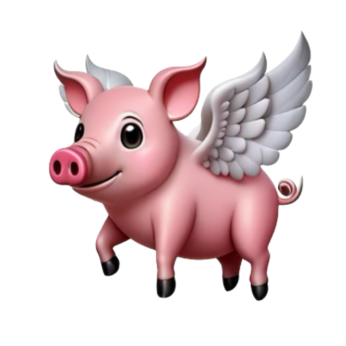
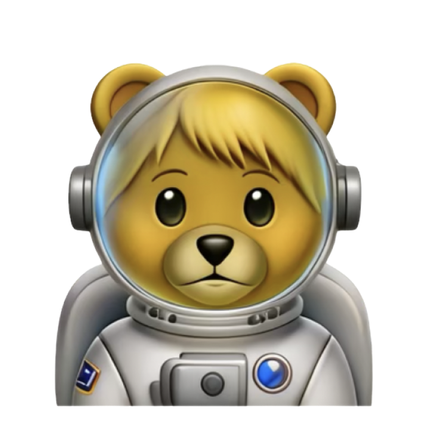
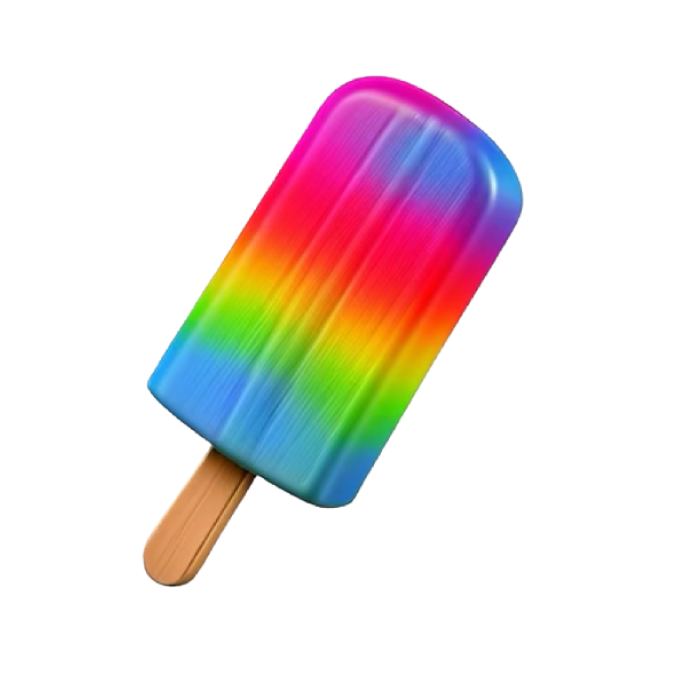

## What is Open Genmoji?

Open Genmoji attempts to recreate Apple's Genmoji feature, but with open source technology! Open Genmoji works anywhere—Not just Apple devices.

Here's a sneak peek of what Open Genmoji is capable of:
|  |  | |  |  |  |  |
| --------------------------------------------------------- | ---------------------------------------------------- | ------------------------------------------------------- | -------------------------------------------------------- | ----------------------------------------------------- | ---------------------------------------------------- |---------------------------------------------------- |

<details>
<summary>Prompts, Apple Genmoji Comparison, and More Information</summary>

All shown emojis were created with Open Genmoji and Prompt Assist. The exact same prompt was given to both Open Genmoji and Apple. Prompt Assist was run with Qwen 2.5 32B Instruct.

Background of emojis removed with Figma AI.

The 7 samples were selected to demonstrate the ability of Open Genmoji across Animal, Object, and Person emojis.

| Prompt                                                                  | Open Genmoji                                              | Apple                                              |
| ----------------------------------------------------------------------- | --------------------------------------------------------- | -------------------------------------------------- |
| `flying pig white wings` (Animal Emoji)                                 |  |  |
| `handsome horse in black suit and tie with flowing mane` (Animal Emoji) |       |       |
| `teddy bear in space suit` (Animal Emoji)                               |  |  |
| `rainbow popsicle` (Object Emoji)                                       |    |    |
| `fireplace` (Object Emoji)                                              |   |   |
| `robber with money bag` (Person Emoji)                                  |      |      |
| `hiker` (Person Emoji)                                                  |       |       |

</details>

<br>

At its core, Open Genmoji is simply a LoRA file (available on [HuggingFace](https://huggingface.co/EvanZhouDev/open-genmoji)), finetuned based on thousands of Apple emojis, that teaches an image generation model to create emojis. Anywhere you can add a LoRA onto an image generation model, you can use Open Genmoji.

Open Genmoji also comes with a built special metaprompt, known as [Open Genmoji Prompt Assist](#prompt-assist) to help you create the perfect prompt to make any emoji you want.

The best part? You can also [use your creation in iOS 18+ as a real emoji](#postprocessing)—Even if your phone doesn't support Apple Intelligence.

If you're experienced with Image Models, go to [Quickstart](#quickstart). Otherwise, check out the [Tutorial](#tutorial) for a full explanation.

Be sure to read the [Important Things to Know](#important-things-to-know) and [Tips for Prompting](#tips-for-prompting)!

## Table of Contents

- [Important Things to Know](#important-things-to-know)
- [Downloading the Model](#downloading-the-model)
- [Quickstart](#quickstart)
- [Tips for Prompting](#tips-for-prompting)
- [Prompt Assist](#prompt-assist)
- [Tutorial](#tutorial)
  - [Running Open Genmoji with `mflux`](#running-open-genmoji-with-mflux)
  - [Running Open Genmoji with Prompt Assist](#running-open-genmoji-with-prompt-assist)
  - [LM Studio Prompt Assist and `mflux` Workflow](#lm-studio-prompt-assist-and-mflux-workflow)
- [Postprocessing](#postprocessing)
- [Contributing](#contributing)

## Important Things to Know

> **Please read this before continuing with the repository!**

TL;DR: Use **Python 3.11** and **use HuggingFace** to download weights

1. This project **works best with Python 3.11**. If you have a Python Version Manager, simply instally Python 3.11, and use the `python3.11` command in place of all commands that say `python3`, and also ensure to create your `venv` with `python3.11`
2. The weights for this project are **hosted on HuggingFace** at [EvanZhouDev/open-genmoji](https://huggingface.co/EvanZhouDev/open-genmoji). Check [Downloading the Finetune](#downloading-the-finetune) below for more info.

## Downloading the Finetune

This model available on HuggingFace at [EvanZhouDev/open-genmoji](https://huggingface.co/EvanZhouDev/open-genmoji). However, there's a script included in this repository that makes downloading simple.

First, clone into this repo:

```bash
git clone https://github.com/EvanZhouDev/open-genmoji.git
```

Next, we need to install the `huggingface_hub` library. It is recommended you first create a `venv`.

```bash
# Create a venv, optional
python3 -m venv .venv
source .venv/bin/activate

# Install huggingface_hub
pip install -U huggingface_hub
```

Now, all you have to do is run the `download.py` script available in the root directory:

```bash
python3 download.py
```

Check that `lora/flux-dev.safetensors` is installed. It should be a 209MB file. You're all good to go!

## Quickstart

> If you're looking for detailed steps to run the model, check out the [Tutorial](#tutorial)

If you know what you're doing, here's a quickstart guide:

- Get the LoRA for Flux.1 Dev from HuggingFace at [EvanZhouDev/open-genmoji](https://huggingface.co/EvanZhouDev/open-genmoji). Check out [Downloading the Finetune](#downloading-the-finetune) above for more info.
- A metaprompt for Open Genmoji is available in `METAPROMPT.md`, so you can create the perfect prompt. [Learn more here.](#prompt-assist) I highly recommend using it!
- Run Flux.1 Dev with the LoRA. Check out [Postprocessing](#postprocessing) to learn how to use your creation as a real emoji in iOS 18

## Tips for Prompting

The trigger word for the LoRA (what the image model needs to "hear" to start generating emojis) is "emoji". If you do not include this in your prompt, there is a high chance it won't generate an actual emoji.

Furthermore, in order to develop a good prompt, I **highly recommend using Prompt Assist**.

## Prompt Assist

Open Genmoji Prompt Assist is a metaprompt for Open Genmoji, to help you generate the perfect prompt for Open Genmoji finetuned models. Note that this metaprompt is specifically for Apple's emojis. If you are using/making a LoRA for Google, Microsoft, etc. emojis, this metaprompt will not work as well.

Here's an example of what Prompt Assist does:

| Input        | Output                                                                                                                                      |
| ------------ | ------------------------------------------------------------------------------------------------------------------------------------------- |
| `flying pig` | `emoji of flying pink pig. enlarged head in cartoon style. cute. white wings. head is turned towards viewer. 3D lighting. no cast shadows.` |

Now, you can focus on imagining the perfect emoji, while Prompt Assist helps you phrase it in a way that image models can understand.

The metaprompt is available in `METAPROMPT.md`. You can use this prompt in any LLM, such as ChatGPT, to generate a prompt for Open Genmoji.

Check out [LM Studio Prompt Assist and `mflux` Workflow](#lm-studio-prompt-assist-and-mflux-workflow) for my full workflow of using LM Studio and `mflux` together to run Open Genmoji on Mac.

## Tutorial

> This tutorial is specifically for Mac. However, Open Genmoji is completely adaptable for other operating systems. You will just need another tool to run Flux.1 Dev, with a LoRA.

If you're new to Image Generation or locally running models, this is the place for you. This guide will lead you through all the steps necessary to run Open Genmoji, and also use the Open Genmoji Prompt Assist metaprompt.

First, let's get started by simply running the model.

### Prerequisites

Before everything, we need to set up Hugging Face. If you already have a Hugging Face token, logged in to the CLI, and agreed to Flux.1 Dev terms and conditions, skip to [Running Open Genmoji with `mflux`](#running-open-genmoji-with-mflux)

**Setting Up Hugging Face**:

1. Go to [Hugging Face](https://huggingface.co) and make an account. Verify your email.
2. Go to [Hugging Face Token Settings](https://huggingface.co/settings/tokens) and create a token. Ensure you either have Token Type of **Read** at the top, or check **Read access to contents of all public gated repos you can access** in token type Fine-grained.
3. Install the [Hugging Face CLI](https://huggingface.co/docs/huggingface_hub/en/guides/cli) with your method of choice (Homebrew, pip, etc.)
4. Run `huggingface-cli login` and use your token to login
5. Finally, go to [Flux.1 Dev Hugging Face Page](https://huggingface.co/black-forest-labs/FLUX.1-dev). Read and agree to the terms at the top to use the Gated model.

You're all done! When you run `mflux` below for the first time, it'll automatically download Flux.1 Dev.

### Running Open Genmoji with `mflux`

The image model we'll be using in this guide is Flux.1 Dev. Open Genmoji takes the form of a LoRA, which is just a file that can teach the image model how to do something specific. In this case, create emojis!

First, clone this repository:

```bash
git clone https://github.com/EvanZhouDev/open-genmoji.git
```

Next, we need to install some dependencies. It's recommended we create a `venv`:

```bash
# Create a venv, optional
python3 -m venv .venv
source .venv/bin/activate

# Install huggingface_hub and mflux
pip install -U huggingface_hub mflux
```

Here's what those dependencies are:

- `huggingface_hub`: This will help us download the weights that we need to run Open Genmoji
- `mflux`: This is a port of Flux (to run our image generation model), specifically for Mac.

Now, let's actually install the weights. They're on HuggingFace at [EvanZhouDev/open-genmoji](https://huggingface.co/EvanZhouDev/open-genmoji), but there's a quick installation script you can run in this directory:

```bash
python3 ./download.py
```

After it's done installing, verify that `lora/flux-dev.safetensors` is downloaded. That'll be the LoRA that you'll be using.

Now, you're all good to go. Run the following command and you'll be able to create your first emoji. Play around with the prompt, and see what you can make. (If you're struggling with a good result, check out [Prompt Assist](#running-open-genmoji-with-prompt-assist))

```bash
mflux-generate \
    --model dev \
    --prompt "your prompt" \
    --steps 20 \
    --seed 2 \
    --quantize 8 \
    --guidance 5.0 \
    --width 160 \
    --height 160 \
    --lora-paths "./lora/flux-dev.safetensors"
```

### Running Open Genmoji with Prompt Assist

It's pretty difficult to get a good prompt to make a Apple-like emoji. Thus, we'll use a metaprompt... a prompt for an LLM, to make a prompt for Open Genmoji. Here's an example:

| Input        | Output                                                                                                                                      |
| ------------ | ------------------------------------------------------------------------------------------------------------------------------------------- |
| `flying pig` | `emoji of flying pink pig. enlarged head in cartoon style. cute. white wings. head is turned towards viewer. 3D lighting. no cast shadows.` |

The output prompt is now much better, and the generated emoji will be of much better quality.

You can run the metaprompt in any place an LLM is available, including ChatGPT! Go grab the prompt from `METAPROMPT.md`. Then, feed it to the LLM, and after it, include your user prompt. Something like this:

```
{METAPROMPT HERE}

USER PROMPT: {your input}
```

Then, take the LLM output and feed that to `mflux`. Observe how the output is much better!

Now that you have a image output, head on to [Postprocessing](#postprocessing) to start using your creation as an actual emoji on your iPhone, or learn a bit more below about how to chain Prompt Assist and `mflux` together.

### LM Studio Prompt Assist and `mflux` Workflow

> If you haven't already, go to [Downloading the Finetune](#downloading-the-finetune) to download the LoRA

It's a bit tedious to feed your own prompt to an LLM, then feed the LLM output to `mflux`. So I made a quick Python workflow to chain these things together.

It's a bit of a specific/personal setup, but I decided to push it in case anyone wants to use it too.

First, you will need to install [LM Studio](https://lmstudio.ai/). Download your favorite local model, and start the Development mode. It should be running on port `1234` (default).

Now, install these two dependencies (in addition to `mflux`):

```bash
pip install mflux pillow requests
```

Now, given that LM Studio is correctly set up, you should be able to directly run:

```bash
python3 genmoji.py "[your prompt]"
```

And it'll first generate a prompt with LM Studio, and feed that into `mflux`. The output should be saved by default in `output/genmoji-001.png` (Number will increase automatically).

> **Note**: Before it saves, it'll also do the Postprocessing step of resizing it to 5x the size with anti-aliasing (160x160 → 800x800). Learn more in [Postprocessing](#postprocessing)

Now, let's take a look at [Postprocessing](#postprocessing) to start using your creation as an actual emoji in iOS.

## Postprocessing

Now that you have a single output image, our first step is to resize to 800x800, with anti-aliasing, so that iOS's Sticker/Emoji system recognizes it. If you've used the all-in-one LM Studio/`mflux` workflow, this step is already done.

If you don't have it installed, first install `pillow` to do the following procedure:

```bash
pip install pillow
```

All you have to do is simply run `python3 resize.py path/to/your/image.png`. This should generate a new image conveniently with "resized" in the name.

Now, all you have to do is send this image over to your phone. Now, follow these simple steps to use it as a Sticker (iOS 17+) or Emoji (iOS 18+):

1. Open the image on your phone in Photos
2. Long press and hold on the emoji in your picture (**don't move your finger**), and release after ~2s
3. Press the **Add Sticker** button

Now, if you're on iOS 17+, you should be able to apply this sticker by dragging it onto a message.

If you're on iOS 18+, in your emoji menu, you can simply tap your sticker to use it inline just like an emoji.

If you want to delete the Sticker, long press and hold (**don't move your finger**) on the Sticker in the Sticker gallery and release after ~2s. Press **Delete**.

## Contributing

Open Genmoji is open to more LoRAs for:

- New models
- New/Different sets of emojis
- More training for existing emoji sets

Check out `finetuning/README.md` for more information about finetuning, and check out `lora/README.md` for the current available LoRAs.
